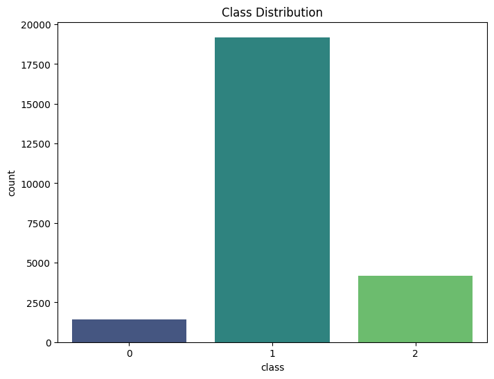

# Hate Speech Detection

This repository contains a machine learning project aimed at detecting hate speech and offensive language from a dataset of tweets. The project involves text preprocessing, feature extraction using NLP techniques, and the application of multiple machine learning algorithms to classify tweets into three categories: Hate Speech, Offensive Language, or Neither.

### Table of Contents
* Introduction
* Features
* Dataset
* Data Visualization
* Usage
* Model Training and Evaluation
* Results
* Text Prediction
## Introduction
Hate speech and offensive language detection is a crucial task in content moderation and social media analysis. This project explores various machine learning models to classify tweets into one of three categories:

* Hate Speech
* Offensive Language
* Neither
* The repository provides all the necessary code for data preprocessing, model training, hyperparameter tuning, and real-time text prediction.

## Features
* Text Preprocessing: Clean and prepare the text data using NLP techniques such as tokenization, stopword removal, and lemmatization.
* Feature Extraction: Convert text into numerical features using TF-IDF Vectorizer for optimal performance with machine learning models.
* Modeling: Multiple machine learning algorithms are implemented:
    * Random Forest
    * Logistic Regression
    * Decision Tree
    * Naive Bayes
* Hyperparameter Tuning: Model tuning is performed using GridSearchCV and RandomizedSearchCV to optimize accuracy.
* Text Prediction: Functionality to predict the category of any input text.
* Data Visualization: Visualizations include class distribution plots and word clouds for better understanding of the data.

## Dataset
The dataset used for this project is the Hate Speech and Offensive Language Dataset, available from Kaggle. The dataset consists of tweets labeled into three categories:

* 0: Hate Speech
* 1: Offensive Language
* 2: Neither
 
## Data Visualization
 ### Class Distribution
 

Word Cloud of Tweets (for each class)

The repository includes scripts to visualize class distributions and word clouds to help understand the data better.
